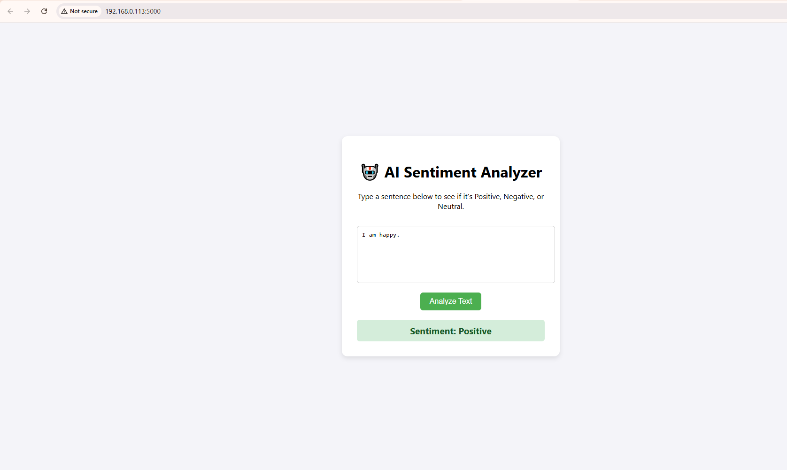

# 🚀 Full-Stack Sentiment Analysis with CI/CD

### Automated Testing, Deployment & Web Interface

**The Goal:** Build a robust "DevOps" pipeline that automatically tests and deploys a Machine Learning application whenever code is pushed to GitHub.

**The App:** A Flask-based web application that uses Natural Language Processing (TextBlob) to analyze text sentiment. It features a modern **HTML/JS Frontend** for user interaction and a REST API for programmatic access.

---

## 📸 Interface



---

## ⚙️ DevOps Architecture

The pipeline consists of three main stages:

1.  **Push:** Developer pushes code to GitHub.
2.  **CI (Continuous Integration):**
    * **GitHub Actions** triggers a workflow.
    * Installs Python 3.9 & dependencies.
    * Runs the test suite (`pytest`) to verify the AI logic.
    * *Guardrail:* If tests fail, the deployment is blocked.
3.  **CD (Continuous Deployment):**
    * **Render** detects the successful commit.
    * Automatically deploys the new version to the live server.

---

## 🛠️ Tech Stack

* **Frontend:** HTML5, CSS3, JavaScript (Fetch API)
* **Backend:** Python 3.9, Flask
* **AI Engine:** TextBlob
* **Testing:** Pytest
* **CI/CD:** GitHub Actions (CI) + Render (CD)
* **Server:** Gunicorn

---

## 🔗 Live Demo

**Try it out here:** `https://sentiment-cicd-touseefq.onrender.com/`

**API Endpoint:** `/predict` (POST)
*Payload:* `{"text": "I love coding!"}`

---

## 🧪 How to Run Locally

1.  **Clone the repository:**
    ```bash
    git clone https://github.com/TouseefQ/sentiment-cicd
    cd sentiment-cicd
    ```

2.  **Install dependencies:**
    ```bash
    pip install -r requirements.txt
    ```

3.  **Start the Server:**
    ```bash
    python app.py
    ```
    *Open `http://localhost:5000` in your browser.*

4.  **Run Tests:**
    ```bash
    python -m pytest
    ```

---

## 🧠 Project Learnings

* **Full-Stack Integration:** Connecting a JavaScript frontend to a Python Flask backend using the Fetch API.
* **Automated Verification:** Using GitHub Actions to ensure backend logic doesn't break before deployment.
* **Production Deployment:** Configuring `gunicorn` to serve both static assets and API endpoints in the cloud.